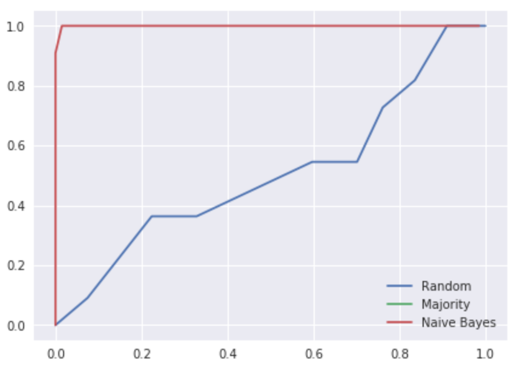

MLE and Naive Bayes Classification
===

> :books: This is homework for 2110597 Pattern Recognition class

# Problem

We will analyze sample genes dataset to classify housekeeping genes.

"Housekeeping genes" is set of genes that our body share basic functions and activites,
such as production of proteins and cell growth. Therefore, housekeeping genes are typically expressed
at consistent levels in every cell and under every condition. In contrast, "tissue-specific genes" are
those reponsible for highly specialized cellular functions and each of them is expressed in only
some tissues in an organism.

The task is simply. Classify these genes, is it a "housekeeping gene" or "tissue-specific gene" under the given dataset under 9 features that are provided.

More description and feature explanation in [task.pdf](task.pdf)

# Usage

This project require [Docker](https://www.docker.com/) to run.

1. Run docker

`docker-compose start`

2. Copy URL that shown from terminal to your browser `http://localhost:8888/?token=<YOUR_TOKEN>`

After Docker completed composing, then click on any files to see the code and playaround.

## File Description

- `task.pdf` – Original task for this project
- `simple-bayes-classifier.ipynb` - Normal distribution graph plot from task 2
- `gene-prediction-bin-bucket.ipynd` – Housekeeping gene prediction with histogram discretization method
- `gene-prediction-gaussian.iynd` – Housekeeping gene prediction with Gaussian maximum likelihood

# Result

| Algorithm                     | Accuracy | Precision | Recall | F1 |
| -------------                 | --- | --- | --- | --- |
| Random Choice                 | 43.58 | 7.69 | 27.27 | 12.00 |
| Majority                      | 85.89 | 0.00 | 0.00 | 0.00 |
| Gaussian MLE                  | 92.31 | 64.70 | 100 | 78.57 |
| Histogram Discretization MLE  | 97.43 | 84.61 | 100 | 91.67 |

The histogram discretization MLE is the best algorithm compared to other algorithm, which archive accuracy to 97.43%
with 91.67% F1 score.

## RoC Curver

# License

[MIT](LICENSE) © Kosate Limpongsa
